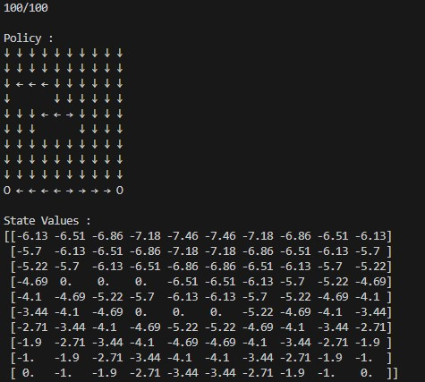

# Grid World

Grid world is one of the popular tabular problem. In this example, I solved grid world problem using DP(Dynamic Programming) algorithms. One is the conventional DP and the other is value iteration DP.

## Policy Evaluation (Prediction)

Policy evaluation is computing the state-value function $v_\pi$ for an arbitrary policy function $\pi$. This can be done by iterative solution method which used for solving system of linear equations. A system of linear equations can be given by the Bellan equation:

$$v_\pi(s)=\sum_a \pi(a\vert s)\sum_{s',r}p(s',r\vert s,a)\bigg[r+\gamma v_\pi(s')\bigg]$$

## Policy Improvement

The process of making new policy by making it greedy w.r.t the value function of the original policy is called policy improvement.

$$ v_{\pi'}(s)=\max_a \ \mathbb{E}\bigg[R_{t+1}+\gamma v_{\pi'}(S_{t+1}) \ \vert \ S_t=s, A_t=a\bigg]$$

## Policy Iteration

We can perform a sequence of improving policies and value functions. This way of finding a n optimal policy is called policy iteration.

$$\pi_0\rightarrow v_{\pi_0}\rightarrow\pi_1\rightarrow v_{\pi_1}\rightarrow\cdots\rightarrow\pi_*\rightarrow v_*$$

## Value Iteration

The one sweep of policy evaluaiton and policy evaluation can be combined as:
$$v_{k+1}(s)\equiv\max_a \ \mathbb{E}\bigg[R_{t+1}+\gamma v_k(S_{t+1})\bigg]$$

## Output

